# Taylor Soule | Cybersecurity Portfolio

## 👤 About Me
Welcome! I'm **Taylor Soule**, a cybersecurity student at Portland Community College pursuing an Associate of Applied Science in Cybersecurity (Expected June 2026).

I'm passionate about Security Operations (SOC), threat detection, incident response, Windows Server administration, Active Directory, Linux, cloud security, and vulnerability management. This portfolio showcases the hands-on projects I've completed through virtual labs, coursework, and independent learning to prove my readiness for a cybersecurity internship.

---

## 🛠️ Technical Skill Inventory

* **Operating Systems:** Windows Server 2022, Windows 10/11, Ubuntu Linux, Kali Linux
* **Active Directory & GPOs:** ADUC, Group Policy Software Installation, Folder Redirection, GPO Scripts, Administrative/Security Templates
* **Network Security & Tools:** Wireshark, Nessus, OpenVAS (Greenbone), pfSense (Firewall/NAT), DMZ Segmentation, Zenmap, Nmap, TCP/IP troubleshooting, DNS, DHCP, VPNs, Linksys LAPAC1750PRO Emulator
* **Defensive & Security Operations:** Snort (NIDS/HIDS), Sguil (IDS Alerts Monitoring), Centralized Logging, Phishing Header Analysis, Email Security
* **Public Key Infrastructure (PKI):** CA Installation, Certificate Lifecycle Management, CA Backups
* **Wireless Security & Exploitation:** WEP/WPA analysis, `aircrack-ng` suite, Packet decryption
* **Penetration Testing, MitM & Web AppSec:** Burp Suite (Web Proxy), Ettercap, `arpspoof`, Social Engineer Toolkit (SET), Web App Attacks (SQLi, XSS), Fingerprinting
* **Scripting & Troubleshooting:** Python (text parsing), Bash, Vim, System Diagnostics Tools

---

## 💻 Featured Technical Projects & Labs

### 1. Advanced Active Directory & Group Policy Management
* **Objective:** Implement advanced domain administration policies to automate software deployment, secure user profiles, and enforce configuration standards.
* **What I Did:**
    * Automated software deployment using GPOs.
    * Protected user data with Folder Redirection.
    * Standardized system behaviors using GPO scripts.
    * Enforced organizational security baselines with Administrative Templates.
* **Core Skills:** Active Directory, GPOs, Folder Redirection, Security Baselines, Software Deployment

---

### 2. Public Key Infrastructure (PKI) & Certificate Management
* **Objective:** Install and manage a local Active Directory Certificate Services (AD CS) environment to secure internal network traffic.
* **What I Did:**
    * Installed a Certificate Authority (CA) on Windows Server 2022.
    * Managed certificate lifecycles (CSRs, approvals, revocations, CRLs).
    * Performed CA database maintenance and registry backups.

#### 📸 Screenshots

  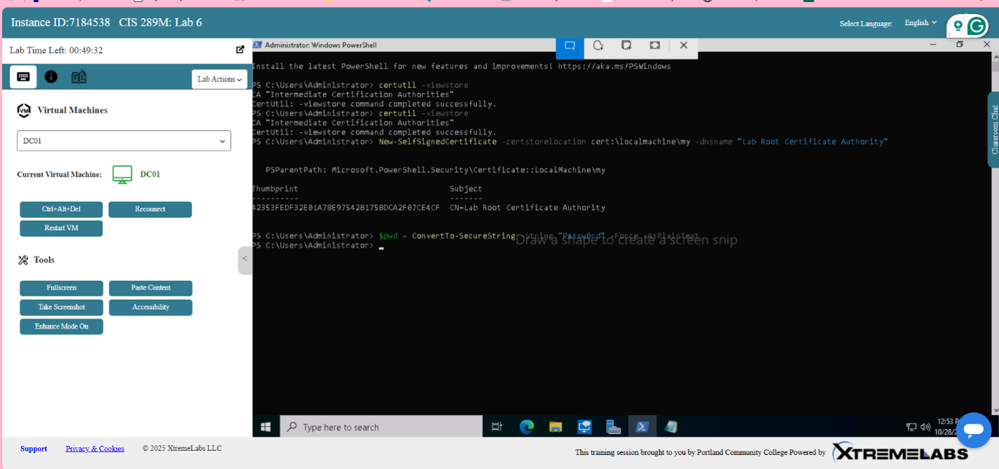

  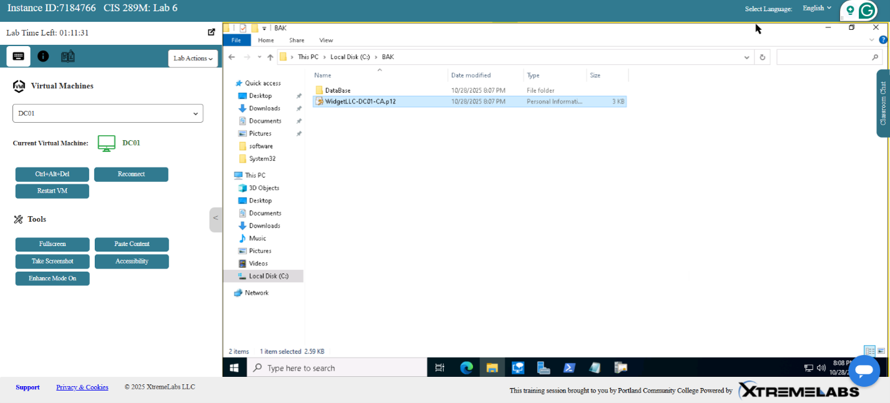

* **Core Skills:** AD CS, PKI, Cryptography, Disaster Recovery

---

### 3. Centralized Patch Management with WSUS
* **Objective:** Automate system updates and minimize endpoint vulnerabilities.
* **What I Did:**
    * Installed WSUS on Windows Server 2022.
    * Directed client updates using GPOs.
    * Managed patch testing, approvals, and compliance reporting.
* **Core Skills:** WSUS, Patch Management, GPOs, System Auditing

---

### 4. Defense-in-Depth, Firewall Engineering, & IDS/IPS Deployment (pfSense & Snort)
* **Objective:** Respond to a simulated Red Team vulnerability report by configuring network firewalls, securing DMZs, and deploying intrusion detection/prevention systems.
* **What I Did:**
    * **Engineered Network Segmentation & NAT:** Configured a **pfSense** virtual firewall, implementing Port Forward rules for public web servers and hardening a permissive DMZ ruleset to drop unauthorized traffic (including filtering out "martian/bogon" packets).
    * **Deployed Network-Based IPS (NIDS/NIPS):** Configured and enabled **Snort** on the pfSense DMZ interface, implementing a "Balanced" IPS policy to actively monitor and block malicious network-level payloads.
    * **Configured Host-Based IDS (HIDS):** Compiled and launched local Snort configurations on Linux web servers, creating custom local rulesets to monitor host-level directory integrity and system processes.

#### 📸 Screenshots

  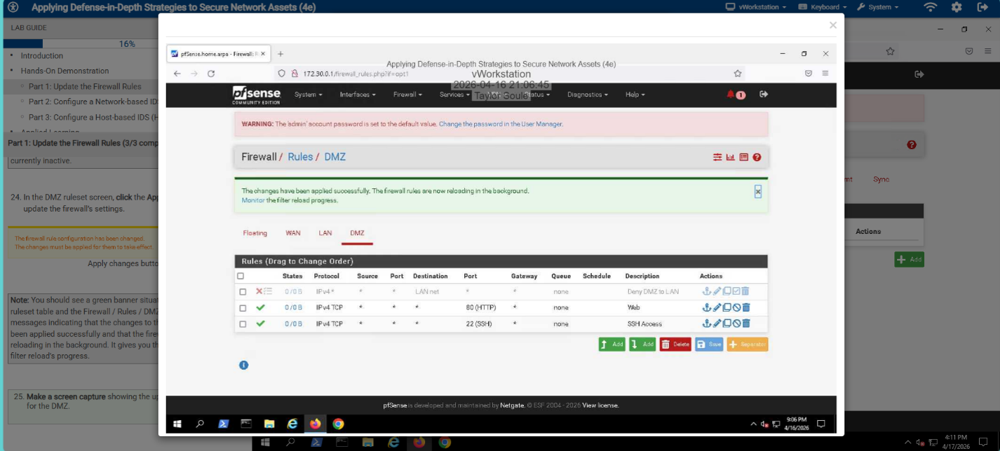

  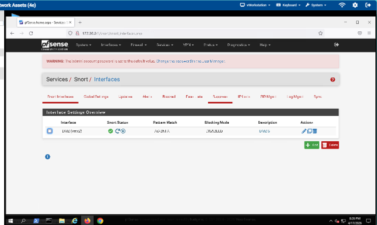

* **Core Skills:** pfSense Administration, Snort (NIDS/HIDS), DMZ Segmentation, Firewall Rulesets, Network Address Translation (NAT)

---

### 5. SIEM & IDS Event Monitoring (Sguil & Log Analysis)
* **Objective:** Monitor and respond to live IDS alerts.
* **What I Did:**
    * Monitored live alerts in Sguil.
    * Investigated packet payloads.
    * Centralized log collection from Windows and Linux hosts.
* **Core Skills:** Sguil, IDS/IPS, Incident Detection, Event Verification

---

### 6. Wireless Network Security & Penetration Testing
* **Objective:** Analyze wireless vulnerabilities and decrypt legacy Wi-Fi traffic.
* **What I Did:**
    * Configured enterprise Wi-Fi settings.
    * Captured and compared encrypted vs. unencrypted packets.
    * Recovered WEP keys using `aircrack-ng`.

#### 📸 Screenshots

  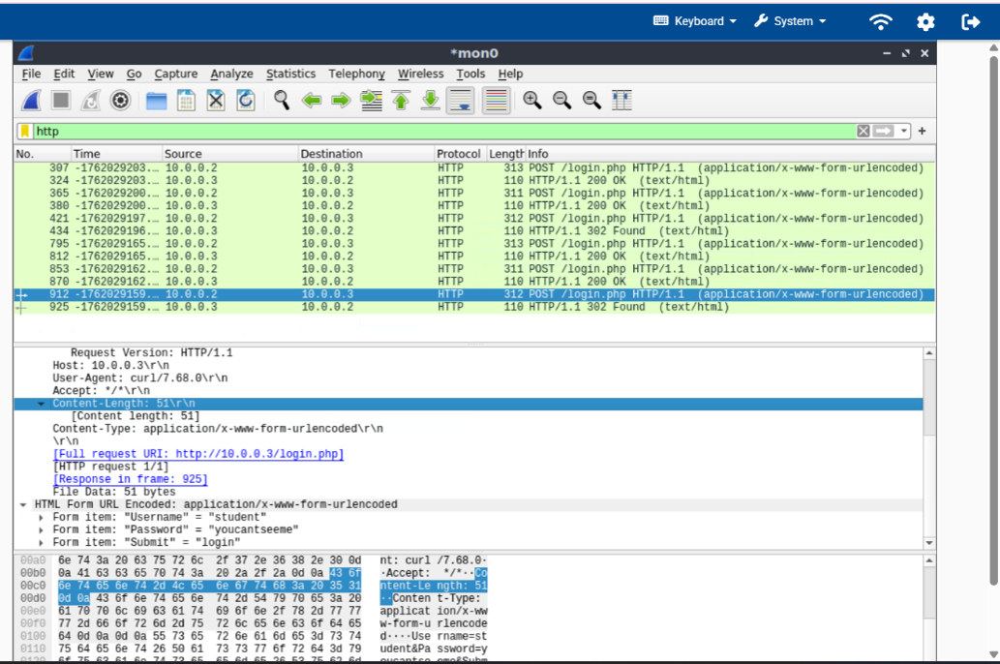

  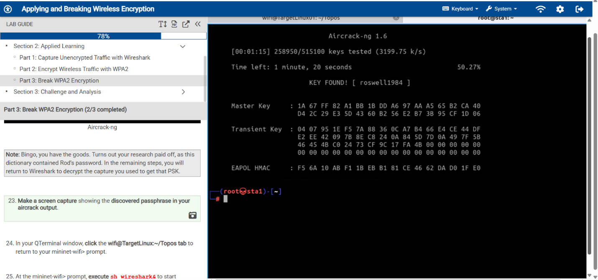

* **Core Skills:** Wireless Security, Wireshark, `aircrack-ng`, WEP/WPA Decryption

---

### 7. Active Network Fingerprinting & Reconnaissance (Nmap & Zenmap)
* **Objective:** Map hosts, identify ports, and fingerprint operating systems.
* **What I Did:**
    * Mapped network layouts with Zenmap to visualize network topology across subnets (`172.30.0.0/24` and `172.31.0.0/24`).
    * Performed active OS fingerprinting scans to identify active operating systems.
    * Evaluated firewall behaviors by comparing the results of SYN scans versus ACK scans to trace filtered port configurations.
    * Used Nmap Scripting Engine (NSE) scripts (like `ssh-hostkey`) for safe vulnerability and configuration detection.
* **Core Skills:** Zenmap, Nmap, OS Fingerprinting, Reconnaissance, Firewall Detection, Scripting Engine (NSE)

---

### 8. Social Engineering & Phishing Simulations (SET)
* **Objective:** Assess user susceptibility to phishing attacks.
* **What I Did:**
    * Built phishing payloads using SET.
    * Analyzed SMTP headers (SPF, DKIM, DMARC).
    * Compiled threat reports and defensive strategies.

#### 📸 Screenshot

  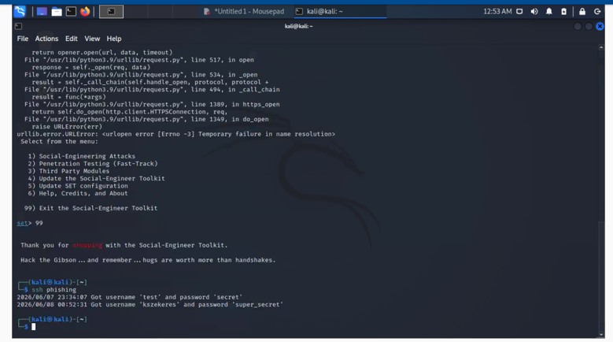

* **Core Skills:** SET, Social Engineering, Phishing Analysis, Threat Investigation

---

### 9. Man-in-the-Middle (MitM) Attacks & Web Session Hijacking (Burp Suite & Ettercap)
* **Objective:** Intercept local network traffic and hijack live web application sessions across secure and insecure channels.
* **What I Did:**
    * **Executed ARP Poisoning Attacks:** Configured **Ettercap** and `arpspoof` to poison local ARP tables, routing traffic between a victim and gateway through the attacker's virtual NIC to sniff cleartext HTTP payload data.
    * **Intercepted and Decrypted HTTPS Traffic:** Established a local proxy via **Burp Suite** and installed a custom CA certificate on target browsers to decrypt secure port 443 (HTTPS) SSL/TLS traffic.
    * **Hijacked Web Application Sessions:** Extracted active session identifiers (cookies) from raw HTTP/HTTPS headers, manipulated requests inside the Burp Suite Repeater, and injected unauthorized actions into the target web application.
* **Core Skills:** Burp Suite (Proxy/Repeater), Ettercap, ARP Poisoning, Session Hijacking, SSL/TLS Decryption

#### 📸 Screenshots

  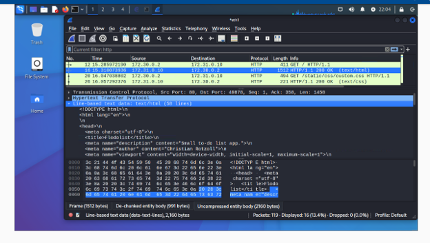

  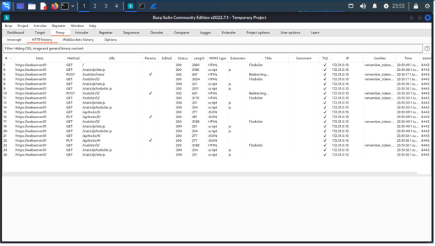

  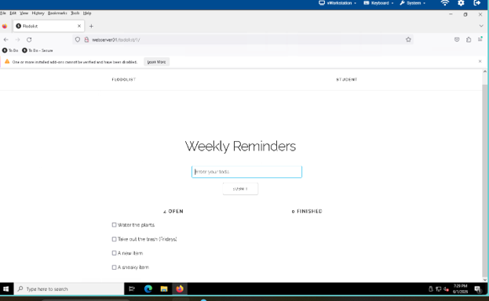

---

### 10. Linux Systems Administration, Vim, & Scripting
* **Objective:** Configure Linux systems using CLI tools.
* **What I Did:**
    * Improved terminal efficiency with Vim.
    * Secured directories with `chown` and `chmod`.
    * Automated tasks with Bash scripts.
* **Core Skills:** Linux Administration, CLI, Vim, Bash Scripting

---

### 11. OWASP Top 10 Web Application Attacks
* **Objective:** Evaluate web application security and exploit common input-validation flaws.
* **What I Did:**
    * Performed SQL Injection to bypass login panels and pull hidden database structures.
    * Executed XSS attacks and reviewed backend sanitization and secure coding practices.
* **Core Skills:** OWASP Top 10, SQLi, XSS, AppSec

---

### 12. Python Security Tool Automation
* **Objective:** Build utilities to parse logs and verify files.
* **What I Did:**
    * Parsed authentication logs.
    * Automated file verification workflows.
* **Core Skills:** Python, Automation, Log Parsing

---

### 13. Host-Based Security Hardening
* **Objective:** Block intrusion paths on Windows and Linux hosts.
* **What I Did:**
    * Hardened Windows Defender and registry access.
    * Secured Linux SSH and firewall configurations.
* **Core Skills:** Endpoint Security, Windows Defender, SSH Hardening

---

### 14. Hypervisor Management & Lab Isolation
* **Objective:** Maintain isolated virtual lab environments.
* **What I Did:**
    * Built isolated NAT and Host-Only networks.
    * Used snapshots for rollback and testing.
* **Core Skills:** VirtualBox, VMware, Virtual Networking

---

### 15. Enterprise Vulnerability Scanning & Analysis (Nessus & OpenVAS)
* **Objective:** Conduct credentialed and uncredentialed vulnerability assessments using industry-standard scanning engines to identify and prioritize network weaknesses.
* **What I Did:**
    * Configured custom scan policies inside **Nessus** to execute targeted vulnerability discovery across internal subnets.
    * Identified critical OS vulnerabilities, discovering and validating high-severity exploits like **MS17-010 (EternalBlue)** by checking plugin output data and system patch states.
    * Performed web and database scans using **OpenVAS (Greenbone)** to detect misconfigured MySQL and MariaDB instances, and extracted actionable mitigation steps from discovery reports.

#### 📸 Screenshots

  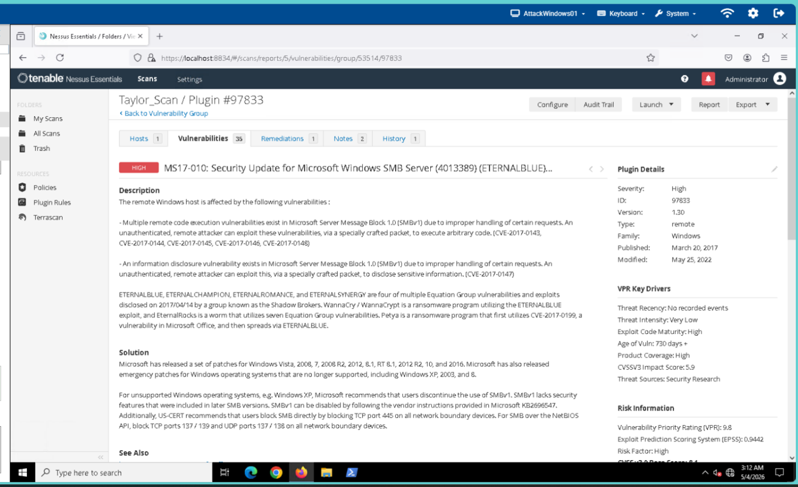

  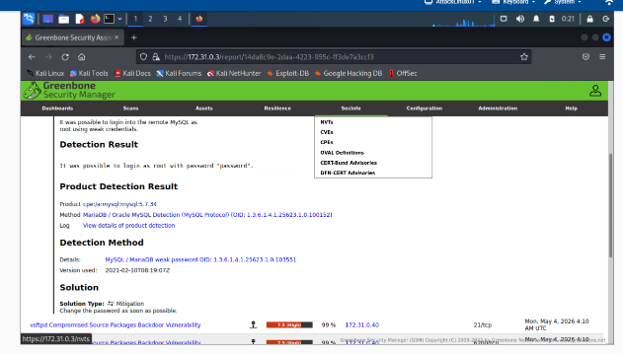

* **Core Skills:** Nessus, OpenVAS, Vulnerability Management, Patch Prioritization, Threat Mitigation

---

## ⚡ Current & Upcoming Labs (In Progress)
* [ ] **AWS IAM Sandbox:** Building users, groups, roles, and custom JSON policies.

---

## 🏆 Certifications & Training
* **CompTIA Security+** *(In Progress)*
* **AWS Academy Cloud Foundations** *(In Progress)*
* **TryHackMe Advent of Cyber**
* **Computer Information Systems Certificate** — PCC
* **Cybersecurity Foundations Certificate** — PCC

---

## 📬 Contact & Professional Links
* **Email:** TaylorSoule143@gmail.com
* **LinkedIn:** [linkedin.com/in/TaylorSouleCybersecurity](https://linkedin.com/in/TaylorSouleCybersecurity)
